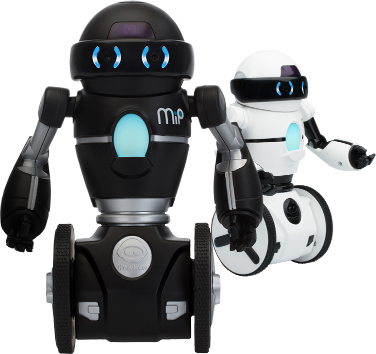

WowWee MiP JavaScript (Node.js) SDK
================================



The free MiP iOS SDK lets you control your [WowWee MiP robot](www.meetmip.com) on any devices which has a Bluetooth Low Energy adapter. To use this SDK you will also need a physical MiP robot.

Pre-built official SDKs are also available for 
[iOS](https://github.com/WowWeeLabs/MiP-iOS-SDK), 
[Android](https://github.com/WowWeeLabs/MiP-Android-SDK), 
[PhoneGap](https://github.com/WowWeeLabs/MiP-PhoneGap-SDK), [Windows](https://github.com/WowWeeLabs/MiP-Windows-SDK.git).

For information on WowWee products visit: <http://www.wowwee.com>

### Installation
`npm install wowweemip`

### Usage
```
var wowweemip = require("wowweemip");
var mipFinder = new wowweemip.Finder();

mipFinder.scan(function(err, robots) {
	if (err != null) {
		console.log(err);
		return;
	}
	
	//connect to first mip
	var selectedMip = robots[0];
	mipFinder.connect(selectedMip, function(err) {
		if (err != null) {
			console.log(err);
			return;
		}
		
		console.log("connected");
		
		//move toward
		selectedMip.driveDistanceByCm(20, 0, function(err) {
			console.log("moving toward");
		});
	});
});
```

### Example
`node example/mip.js` to execute the demo with simple commands

### Debug Mode
Logger is used by debug `npm install debug`

`DEBUG=mip* node example/mip.js` show more logs for mipnode library

`DEBUG=* node example/mip.js` show all logs for mipnode & noble libraries

### Projects using this SDK
* Send us a pull request to add your app here
